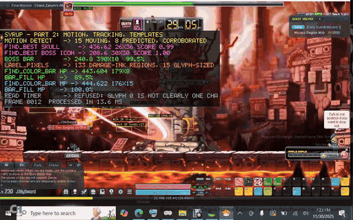
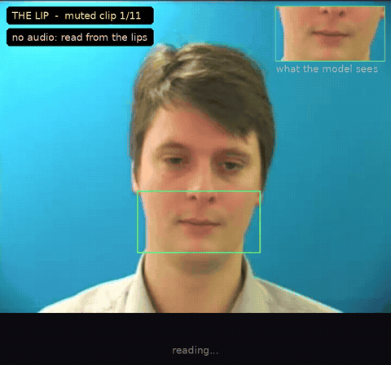

# Syrup

A Rust computer-vision library where you name the function you need and
the library builds it.



*Every number in the overlay is computed by the library on that frame —
motion tracks, template matches, bar fills, a timer read from a font it
learned — and the overlay is drawn with `syrup::draw`.*

```rust
use syrup::prelude::*;

syrup::intent!(fn find_face(image: &RgbaImage) -> Detection<Vec<Match>>);
syrup::intent!(fn measure_red_bar(image: &RgbaImage) -> Detection<f32>);

let frame: RgbaImage = image::open("frame.png")?.to_rgba8();
for face in find_face(&frame).value.unwrap_or_default() {
    println!("face at {:?}, score {:.2}", face.bounds, face.score);
}
println!("HP: {:?}%", measure_red_bar(&frame).value);
```

`find_face` does not exist until that line. The name is parsed against a
small vocabulary — a verb, optional qualifiers, a noun — and turned into a
plan over the library's primitives (here: the bundled Viola–Jones
frontal-face cascade). The plan runs in-process on the first call, or is
written out as Rust, compiled with cargo into a `.so`/`.dll`/`.dylib`, and
loaded back, so the function you invented is also a native library any
process can call (`intent::resolve("find_face")?.compile()`, or
`SYRUP_INTENT_MODE=native`). The generated source is kept next to the
build, so you can read what was invented, copy it, or edit it.

The same from Python, over the library's C API — `import syrup` and any
attribute named like an intent is a function:

```python
import syrup
faces = syrup.find_face(image)      # PIL image or numpy uint8 array
print([f.bounds for f in faces.value], faces.confidence)
```

Syrup reads a screen the way a person does — "there is a bar here and it is
about 60% full", "that region moved left", "this text says 1291/1351" —
without pretending to more certainty than the pixels support. Every result
carries a confidence, a reliability grade, and a failure reason when nothing
was found.

## What is in this repository

| path | what | status |
|---|---|---|
| `src/` | the library: intents (`intent!`, parse → plan → run/compile), Viola–Jones cascades (bundled face, profile, eye), template matching, connected components, motion and tracking, glyph reading and OCR, `face` and `sequence`, drawing, the C ABI and the C API | 162 unit + 4 native + 3 integration + 3 doc tests; clippy clean |
| `python/syrup/` | the Python package over the C API: `syrup.find_face(image)` | 5 tests |
| `python/thelip/` | **The Lip**: lip reading from muted video with live subtitles (syrup finds the mouth, LipNet reads it, decoded again after every frame); demo and proof videos built by `make_demo.sh` and `proof.py` | 64/66 words on the GRID sample clips; 10 tests |
| `example/lipreader/` | the multi-person pipeline: faces → tracks → mouths → speaking → reading → subtitles per person, three modes, honest language registry, exports, evaluation framework | 25 tests; 0% WER on the composited fixtures |
| `example/inference-api/` | the local HTTP service (jobs, streamed sessions, exports, deletion, token, rate limit) | 9 tests |
| `example/chrome-extension/` | Lip Read for YouTube (Manifest V3, TypeScript): overlay, follow a person, side panel, seek, export | 25-check Playwright end-to-end test |
| `example/web/` | one page over the service | 7-check end-to-end test |
| `example/thelip/` | **thelip.syrup**: The Lip in the browser, on a phone (the network in a Web Worker, camera or a recorded clip) | engine matches numpy to 2e-6; reads a GRID clip in Chromium |
| `example/thelip-server/` | any words for thelip.ai: Auto-AVSR's models on your computer, behind a tunnel; Hebrew and better English from thelip-train | routes, languages, learning loop and the worker tested against `--fake`; the English model ran on the owner's PC |
| `example/thelip-train/` | the training pipeline: licensed video → labels → mouth crops → Auto-AVSR fine-tuning → export, under a budget | CPU stages tested on GRID clips in CI; the GPU stages not run yet |
| `example/ios/` | the SwiftUI app (Vision, AVFoundation, Core ML, remote backend) | written without a compiler; not built here |
| `example/minesweeper-coach/` | **a Minesweeper coach** (Rust): watches the game on the screen and says what to do next — the next sure move and why, or the best odds — with the cells marked over the board; never clicks | 34 tests; its advice wins 91% / 81% / 42% of beginner / intermediate / expert games with 0 wrong proofs; reads minesweeper.online screenshots cell for cell; on a Windows runner it watched a game on the screen through and said what the game called for |
| `example/shared-types/`, `example/ml/`, `example/docs/` | the JSON contract, model scripts behind licence gates, and the design, model survey, benchmarks, API and setup docs | — |
| `docs/` | the GitHub Pages site, thelip.ai: the thelip.syrup page and the demo GIFs | published to the `gh-pages` branch by `.github/workflows/pages.yml` |

## The convention

| Name          | Returns             | Meaning                                   |
|---------------|---------------------|-------------------------------------------|
| `find_*`      | `Detection<Vec<Match>>` | zero or more places, strongest first   |
| `track_*`     | `Detection<Vec<Match>>` | the same, with a stable `id` per object across calls |
| `count_*`     | `Detection<f32>`    | how many `find_*` would return            |
| `measure_*`   | `Detection<f32>`    | a percentage or distance                  |
| `read_*`      | `Detection<String>` | text                                      |

An empty `find_*` result (`value: Some(vec![])`) means the search ran and
found nothing. A missing one (`value: None` + `failure_reason`) means it
could not run. The two are never conflated, and a low-confidence answer is
reported as missing with its reason rather than as an answer.

It refuses instead of guessing. Resolution fails, typed and early, when the
name is outside the vocabulary (`Unparsed`, with the vocabulary as a hint),
when the meaning is clear but nothing here can carry it out yet
(`Unsupported`, saying what is missing — a picture of the icon, state for
tracking), when the declared return type does not fit the verb
(`WrongShape`), or when a native build or load fails (`BuildFailed` with
the compiler's log, `LoadFailed`). `syrup::intent::resolve("find_x")` gives
the typed error up front; a declared function that cannot be resolved
returns `Detection::missing` with the same reason on every call.

Vocabulary today — nouns: `face` (frontal, or `profile_face`), `eye`
(inside faces), `<colour>_bar`, `<colour>_blob`, `text`, `<name>_icon`
(a picture you register: `intent::register_template("boss", &image)`, or
`boss.png` in `$SYRUP_TEMPLATES`), `motion`. Verbs: `find`, `track`,
`count`, `measure` (bars), `read` (text). Qualifiers: colours `red orange
yellow green cyan blue purple magenta pink`; a position `top bottom left
right` (that half of the region, before or after the noun); `largest` /
`smallest` (just that one). So `count_largest_red_blobs_bottom`,
`track_boss_icon`, `find_eyes` and `measure_green_bar` are all functions
waiting to be declared. Everything below is what the plans are made of,
and is available directly.

## What it does

- **Geometry** — rectangle segmentation and grouping over pixel predicates,
  and horizontal-bar fill measurement that learns the bar's empty-track
  color from the frame instead of assuming it.
- **Color** — RGB→HSV conversion and the shared pixel predicates (hue-range
  match, "looks like UI text", opacity).
- **Components** — connected-component labelling of masks or pixel
  predicates: the exact regions, each with bounds, area and centroid, not
  just the rectangles around them.
- **Thresholds** — Otsu thresholds, integral images, channel views, and a
  "text evidence" map that lifts glyph strokes off bars and gradients by
  comparing each pixel with its own row's background.
- **Glyph reading** — reads counters and HUD values drawn in a fixed pixel
  font by matching each glyph against a font learned from a few labelled
  crops. It is fast, needs no external tools, and refuses to answer when
  any glyph is ambiguous: an unreadable value comes back as *unknown*,
  never as a wrong number.
- **Motion** — single-pass frame differencing plus a tracker that gives
  moving regions stable IDs, velocity, and occlusion grace. Detections are
  matched to tracks optimally, so nearby objects do not swap identities.
- **Template matching** — finds a known picture (an icon, a UI marker, a
  status glyph) anywhere in a frame by normalised cross-correlation, so
  brightness and contrast differences don't affect the score. Large
  searches use a coarse-to-fine image pyramid instead of scoring every
  position at full resolution; small searches are scored exhaustively.
  Returns a sub-pixel centre estimate.
- **Cascades** — Viola–Jones boosted cascades of Haar features, evaluated
  exactly as OpenCV evaluates its cascades, with OpenCV's frontal-face,
  profile-face and eye detectors bundled (245 KB in all, their licences
  alongside). Cross-checked against OpenCV on the same photograph: the
  same face, the same two eyes.
- **Faces** — once a face is found, where its eyes and mouth are, how open
  each eye is (blinks) and how open the mouth is (speaking, lip shapes).
  Proxies for what the pixels show, documented as such.
- **Sequences** — dynamic time warping and a nearest-example matcher for
  things that unfold over frames: a mouthed word, a gesture, a pattern of
  motion. Refuses when two examples are equally close.
- **OCR** — text recognition via a Tesseract subprocess, with the crop
  prepared the way Tesseract reads best (dark text on light, levels
  stretched, enlarged, framed by a margin), per-word confidence and boxes,
  and a configurable page mode and character whitelist; on Windows, the
  OS's built-in OCR engine is also exposed, which is trained on screen
  content.
- **Quality** — a sharpness metric that predicts whether OCR on a region
  can succeed at all, so blurred input is reported as *blurred* rather than
  silently producing wrong text.
- **Capture** — live window capture by title on Windows (works while the
  window is occluded), or the whole screen with where it sits on the
  desktop; portable stubs elsewhere.
- **Debug drawing** — rectangles and a dependency-free 5×7 bitmap font for
  annotating frames with what a detector saw.
- **Timing** — FPS and moving-average measurement.

## Live examples

Both take raw RGBA frames on stdin and write annotated frames to stdout,
so a webcam, a window or a file reaches them through ffmpeg:

```sh
ffmpeg -v error -f v4l2 -video_size 640x480 -i /dev/video0 -pix_fmt rgba -f rawvideo - \
  | cargo run --release --example face_cues -- 640 480 30 \
  | ffplay -v error -f rawvideo -pix_fmt rgba -video_size 640x480 -
```

(Windows: `-f dshow -i video="Integrated Camera"`; macOS: `-f avfoundation
-i "0"`; a file: `-i clip.mp4 -r 15`.)

- `face_cues` — the behavioural signals that "lie detection" folklore
  points at, measured honestly: blink rate, head motion, gaze shifts, mouth
  activity, facial motion, each against the person's own first ten seconds.
  The overlay calls the result arousal, because that is all it is: no
  measurement of a face tells truth from lies, and this one does not claim
  to.
- `lip_reading` — `learn hello 640 480 30` records the mouth's shape and a
  small normalised picture of it each time you say the word; `read 640 480
  30` names what you say from the words it has examples of, and shows `?`
  when two are equally close. Your words, your camera; arbitrary lip
  reading needs a learned model this library does not have.

## Example projects: lipreader

[`example/`](example/) is the library carrying a product: **lipreader**,
probabilistic lip reading of one or many visible people — a Chrome
extension for YouTube (subtitles from the lips over the video, a
transcript panel, SRT/VTT/JSON/TXT export), a web page, a local inference
service, the Python pipeline behind them (faces → tracks → mouths →
speaking → reading, batched, with word-level confidence and `[word?]` for
doubt), and a native iOS app. English runs today (LipNet, GRID's
vocabulary); the other languages are surveyed with their licences and wired
as adapters, not pretended. Measured numbers, tests and the honest status
of every piece: [`example/README.md`](example/README.md).

## Example project: a Minesweeper coach

[`example/minesweeper-coach`](example/minesweeper-coach) watches a
Minesweeper game on your screen and talks you through it, the way a friend
looking over your shoulder would: *"This 1 already has its mine, so the
green cells around it are safe"*, *"No sure move. Your best bet is the
yellow cell: about 7 percent risk"*. The board is found and read off the
screen with syrup's connected components, at any size and anywhere on
the screen. Every hidden cell's chance of a mine is counted exactly. Its
marks are drawn over the board in a click-through window that keeps out of
screen captures, and the voice is the system's own. It never clicks.

## thelip.syrup

The Lip on your phone: **https://thelip.ai/**
runs the lip reader in the browser (a Web Worker, plain JavaScript, no
upload, no audio). Point the camera at your mouth, say a sentence from its
vocabulary, and read it back. Source in [`example/thelip`](example/thelip).
For **any words**, run [`example/thelip-server`](example/thelip-server)
on a computer: the page finds it by itself (or a printed link points the
page at it) and reads with open-vocabulary models running there — English
(Auto-AVSR on LRS3), Spanish, French, Portuguese, Mandarin (non-commercial
weights) — every face in the picture on its own, even two people talking
at once. Readers can keep their sentences, labelled by what the microphone heard
(speech recognition, so nobody types) and corrected with a tap; that, and
video whose licence allows it, is what [`example/thelip-train`](example/thelip-train)
trains on: English adapted to phones, and the first Hebrew lip-reading
model, which does not exist anywhere yet.

## The Lip



Lip reading from **muted** video with subtitles that form while the person
speaks: [`python/thelip`](python/thelip). syrup finds the face and the
eyes and locates the mouth on every frame; LipNet (Assael et al. 2016),
run in numpy from its published weights, reads the lips; the prefix seen
so far is decoded again after every frame. On the eleven GRID sample clips
that ship with LipNet it reads 64 of 66 words with no audio. It reads
GRID's 51-word vocabulary, not open English — the README there says
exactly what it can and cannot do, and how to run it. `proof.py` there
builds a longer video: each clip muted and then with its sound, a
fresh-clone session recorded for real, and the code stepped through.

## What it deliberately does not do

- No input synthesis, no window manipulation, no process inspection: the
  library **reads pixels and reports observations**, nothing else.
- No trained models and no model files in the library: every primitive is
  deterministic and explainable, which keeps results reproducible in
  tests. (The Lip, in `python/thelip`, is an application that feeds one
  trained model from the library's face and eye detection, and says so.)
- No opinion about what an observation *means* — semantics belong to the
  application built on top.

## Example

```rust
use syrup::color::is_color_pixel;
use syrup::geometry::{Rect, find_color_bar, measure_bar_fill};

let image: image::RgbaImage = image::open("screen.png")?.to_rgba8();

// Look for a red horizontal bar in the bottom band of the screen…
let band = Rect { x: 0, y: image.height() * 9 / 10, w: image.width(), h: image.height() / 10 };
let red = |p: &image::Rgba<u8>| is_color_pixel(p, (340.0, 30.0), 0.35, 0.30);

if let Some(bar) = find_color_bar(&image, band, (340.0, 30.0), 0.35, 0.30) {
    // …and measure how full it is against its own track.
    if let Some(percent) = measure_bar_fill(&image, bar, band, red) {
        println!("bar at {bar:?} is {percent:.1}% full");
    }
}
# Ok::<(), image::ImageError>(())
```

Reading a value drawn in a known pixel font — learn the font once from a
crop whose text you know, then read new frames:

```rust
use syrup::glyphs::{GlyphOptions, GlyphSet};

let mut font = GlyphSet::new(GlyphOptions::default());
font.learn(&labelled_frame, value_region, "1291/1351")?;

let reading = font.read(&frame, value_region);
match reading.value {
    Some(text) => println!("{} ({})", text.text, reading.confidence),
    None => println!("unreadable: {}", reading.failure_reason.unwrap_or_default()),
}
```

Frames are plain `image::RgbaImage` buffers, so they can come from a
screenshot, frames extracted from a video, a synthetic fixture in a test,
or `syrup::capture` — every primitive behaves identically regardless of
the source.

## Architecture

```text
syrup::intent!(fn find_red_bar(image: &RgbaImage) -> Detection<Vec<Match>>)
    │
    │  intent      parse the name → Intent { Find, [Red], Bar }
    │              plan            → Plan::ColorBars { Red }
    │              run             → in-process, or
    │              compile         → source → cargo (cdylib) → libloading   ─┐
    ▼                                                                       │ C ABI
RgbaImage (any source)                                                      │ (abi)
    │                                                                       │
    ├─ geometry / color / threshold  locate regions by shape, colour and contrast
    ├─ components                    the exact connected regions
    ├─ motion / tracking             what moved, with stable identity
    ├─ template / cascade            where a known picture, or a face, is
    ├─ face / sequence               a face's parts and what they do over time
    ├─ glyphs / ocr / quality        what text says, and whether it is readable at all
    │
    ▼
Detection<T> — value + confidence + reliability + failure reason
```

`capi` exposes the same resolve/run/free cycle as plain C functions when
the crate is built as a shared library, which is what `python/syrup` calls
through `ctypes` — and what any other language would.

The primitives are the vocabulary; a plan is a sentence in it. The same
plan runs in-process or compiled, through the same functions
(`intent::plans`), so the two can never disagree — the native test checks
that they don't.

The `Detection<T>` vocabulary is the library's one contract: a detector
never returns a bare "not found" — it says *why* not, and never returns a
value without saying *how sure* it is.

## Testing

```sh
cargo test          # unit, integration and doc tests
cargo test -- --ignored   # also run OCR against a real Tesseract install
cargo clippy --all-targets -- -D warnings
cargo bench         # criterion benchmarks for the per-frame primitives
cargo run --release --example intents   # declare, run, and compile an intent
cd python && python3 test_syrup.py      # the Python package against the built library

# The Lip and the example projects (Python 3.11+, ffmpeg, Node 18+ with typescript and playwright)
example/ml/models/get_lipnet.sh                      # LipNet weights and GRID sample clips (MIT / CC BY 4.0)
python3 python/thelip/test_thelip.py                 # The Lip
cd example/lipreader && python3 tests/make_fixtures.py && python3 tests/test_lipreader.py
cd ../inference-api && python3 tests/test_api.py
cd ../shared-types && tsc -p tsconfig.json && cd ../chrome-extension && tsc -p tsconfig.json
NODE_PATH=$(npm root -g) node test/e2e.mjs           # the extension, in Chromium, against the service
cd ../web && NODE_PATH=$(npm root -g) node test/e2e.mjs
cd ../thelip && node test/engine.test.mjs && python3 build.py && NODE_PATH=$(npm root -g) node test/page.test.mjs
```

CI (`.github/workflows/ci.yml`) runs the Rust checks on Linux, Windows and
macOS and all of the above on Linux; `pages.yml` publishes `docs/` to the
`gh-pages` branch, which GitHub Pages serves.

Tests run against synthetic, in-code fixtures plus one public-domain
photograph (`tests/fixtures`); no network access is required. The native
intent tests (`tests/intent_native.rs`) build a crate with cargo, which
takes about a minute the first time and is cached after; set
`SYRUP_SKIP_NATIVE_TESTS=1` to leave them out. OCR tests cover argument
construction, TSV parsing, box mapping, preprocessing and temp-file hygiene
without invoking Tesseract; one opt-in test runs the real engine end to
end. Nothing in the suite depends on a domain edition, so this repository
stands alone.

## Performance

Criterion benchmarks on one 1366×768 frame (`cargo bench`; one x86-64
core, default target features). "Before" is the code as it was extracted
from MapleSyrup.

| Benchmark                                   | Before  | Now     |
|---------------------------------------------|--------:|--------:|
| Motion detection, one moving object         | 6.25 ms | 0.66 ms |
| Motion detection, whole view panning        | 7.57 ms | 2.12 ms |
| Colour-bar search in a status band          | 1.18 ms | 0.52 ms |
| Dominant colour + uniform-panel search      | 3.37 ms | 1.42 ms |
| Bar-fill measurement                        | 14 µs   | 14 µs   |
| Connected components, 400 blobs             | —       | 0.72 ms |
| Text evidence, 124×22 crop                  | —       | 14 µs   |
| Glyph reading, 9-character value            | —       | 86 µs   |
| Glyph reading, unreadable 40 px smear       | —       | 0.70 ms |
| Tracker update, 60 crowded objects          | —       | 38 µs   |
| Template search, 32 px icon, whole frame    | —       | 15 ms   |
| Template search, 64 px icon, whole frame    | —       | 7.5 ms  |
| Template search, 16 px icon, 240×140 region | —       | 1.6 ms  |
| Face cascade, 320×320 photograph, 1 thread (OpenCV: 91 ms) | — | 116 ms |
| Face cascade, 320×320 photograph, 2 threads | —  | 80 ms   |

Motion is the slowest when the whole view changes, because no row can be
skipped; even then it stays well inside a 60 fps frame budget.

The lipreader pipeline's measured speed and accuracy (per fixture, both
face detectors, stage timings) are in
[`example/docs/benchmarks.md`](example/docs/benchmarks.md); the cascade is
the cost there, and it is the library's next performance item.

## Limitations

- The primitives are tuned for rendered UI content (flat colors, pixel
  fonts, hard edges), not for photographs or video of natural scenes.
- Tesseract must be installed separately for OCR (`TESSERACT_BIN`, `PATH`,
  or the standard Windows install locations); without it, OCR reports
  itself unavailable rather than failing. Even on clean text it misreads
  some pixel fonts — prefer the glyph reader wherever the font is fixed.
- The glyph reader reads one line per region, in fonts it was shown.
  Learn from whole lines as they appear on screen: glyphs are measured
  against their line's height, so a slash or a dot learned on its own will
  not match.
- The face detector is OpenCV's frontal cascade: roughly upright, roughly
  front-on faces of 20 px or more. Profiles, heavy tilt and tiny faces are
  not found. A learned detector behind the same plan is the natural next
  step.
- Compiling an intent to a shared library needs `cargo` on the machine at
  run time; running it in-process (the default) does not.
- Live capture is Windows-only. Other platforms consume file-based frames.

## Syrup and MapleSyrup

Syrup is the generic engine. A domain edition consumes it and adds the
knowledge Syrup deliberately lacks — what the pixels *mean* in one
particular application:

```text
        MapleSyrup            the MapleStory edition
             │                github.com/boggioMichael/ms
             │ submodule
             ▼
           Syrup              this repository
```

[MapleSyrup](https://github.com/boggioMichael/ms) is the first such
edition, and is where these primitives were developed against real
captures before being generalised. Syrup itself knows nothing about
MapleStory, or any other application — a second edition for a different
program would consume it exactly the same way.

## License

MIT
