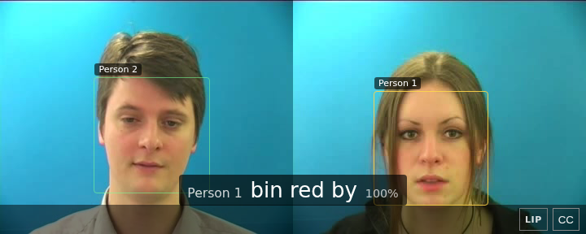
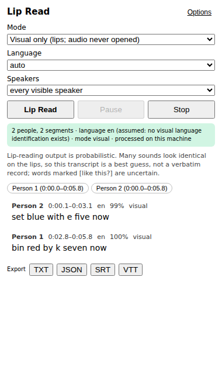

# Example projects

What the syrup library looks like carrying a real product: **lipreader**,
probabilistic lip reading of one or many visible people, delivered as a
Chrome extension for YouTube, a web page, a local inference service, a
Python package, and a native iOS app — built on top of The Lip
(`python/thelip`) and the library's `find_face` / `find_eyes`.

```
example/
  lipreader/          the pipeline (Python): faces -> tracks -> mouths -> speaking -> reading -> subtitles
  inference-api/      the local HTTP service the apps talk to (jobs, streamed sessions, exports, deletion)
  chrome-extension/   Lip Read for YouTube (Manifest V3, TypeScript), with a Playwright end-to-end test
  web/                one HTML page that uses the service
  thelip/             thelip.syrup: The Lip in the browser, on a phone (live site on GitHub Pages)
  ios/                the SwiftUI app (Vision + AVFoundation + Core ML), written without a compiler here
  shared-types/       the JSON schema and TypeScript types every part agrees on
  ml/                 model scripts: get LipNet, fetch research checkpoints behind their licences, export/convert
  docs/               architecture, models, benchmarks, API, setup, decisions
```

<p> </p>

## What works today, measured

| piece | status |
|---|---|
| Pipeline: many faces, tracking, shot cuts, speaking detection, per-person subtitles with word timing and confidence, TXT/JSON/SRT/VTT | works; 25 tests on composited fixtures with exact ground truth; 0% WER on the 1-, 2- and 5-person fixtures, 63/66 words on the GRID sample clips |
| Languages | **English** (LipNet, GRID's 51-word vocabulary) runs here. Spanish, French, Portuguese, Italian, Arabic, German, Greek, Russian, Mandarin exist only as non-commercial research checkpoints that need PyTorch and downloads this build could not make: adapters, scripts and the honest availability table are in place, the models are not run. **Hebrew has no public visual model at all** and is reachable through the audio modes only. |
| Modes | visual (audio never opened), audiovisual, audio-attributed — implemented and tested with a fake recogniser; a real one needs `faster-whisper` installed on the service's machine |
| Inference service | works; 9 tests (jobs, streamed sessions, exports, auth, rate limit, deletion) |
| Chrome extension | works end to end against the service and a fake YouTube page (25 checks in Playwright); real youtube.com and the tab-capture source not exercised here |
| Web page | works; 7 checks in Playwright |
| thelip.syrup (in the browser) | works: the network in a Web Worker, camera on https, record-a-clip elsewhere; reads the GRID clip in Chromium; live at https://boggiomichael.github.io/syrup/thelip/ |
| iOS app | source written against iOS 17 APIs, never compiled (no Xcode here); `// VERIFY:` marks the doubtful sites |
| Speed (2-core Xeon, 25 fps, 360x288 faces) | 0.4x realtime with the OpenCV detector, 1.4x with syrup's cascade; 5 faces at 1080x576: 1.9x / 3.8x — see [docs/benchmarks.md](docs/benchmarks.md) |

Every transcript carries the notice that lip reading is probabilistic;
uncertain words are rendered `[word?]`; a language without a model
produces no text. Nothing here identifies people: tracks are numbers
inside one video.

## Start here

```sh
cargo build --release                                   # syrup's library (the face and eye detector)
pip install numpy opencv-python-headless pillow scipy starlette uvicorn httpx python-multipart
example/ml/models/get_lipnet.sh                         # LipNet weights + GRID clips (MIT / CC BY 4.0)
cd example/lipreader && python3 tests/make_fixtures.py && python3 tests/test_lipreader.py
python3 -m lipreader analyze tests/fixtures/two_simultaneous.mp4 --srt out.srt
cd ../inference-api && python3 -m lipreader_api         # then the extension or web/index.html
```

[docs/setup.md](docs/setup.md) has the rest, [docs/architecture.md](docs/architecture.md)
the design, [docs/models.md](docs/models.md) the model survey and licences,
[docs/decisions.md](docs/decisions.md) the choices and why.
