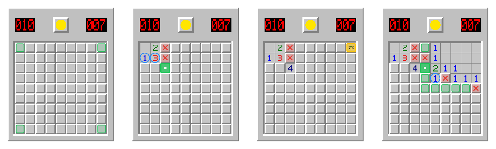

# Minesweeper coach

A coach that watches a Minesweeper game on your screen and tells you, out
loud, what to do next: the next sure move and why it is sure, or, when
nothing is sure, the best odds. It marks the cells on the board as it goes.
It never clicks. You play.

It is built on syrup. The board is found and read off the screen with
syrup's connected components, and the screen comes from
`syrup::capture::capture_screen`. Everything else is here: the solver, what
to say and when, the marks, and the voice.



What it says during a game, played by doing what it says
(`cargo run --release -- demo 3 --level intermediate`):

```
[00:00.0] Minesweeper coach is on. Open a game and I'll help.
[00:00.4] New game. Start in a corner: the first click is always safe.
[00:03.4] This 2's mines are all found, so the green cells around it are safe.
[00:06.4] This 2's mine must be in the cells it shares with the 4, so its other cells are safe.
[00:27.0] The 1 puts this 2's mine in the cells they share, so its other cell is safe.
[00:33.0] This 2's mine must be in the cells it shares with the 4, so its other cell is safe.
[02:04.5] Cleared! Well played.
```

It stays quiet while you go from one easy sure move to the next, since the
green marks already show them. It speaks up for a move that needs two
numbers read together, for the mine count, when you have to guess, when
you gamble while a sure move was there, when a flag is wrong, and at the
end of the game. If you stop for a while with a sure move still open, it
tells you why that move is sure.

## Run it (Windows)

```
cd example/minesweeper-coach
cargo run --release
```

or double-click `coach.cmd`. Then open a game, either on
[minesweeper.online](https://minesweeper.online) or in any Minesweeper
with the classic look, and play. Close the coach's window to stop it.

| option | |
|---|---|
| `--quiet` | speak only for guesses, mistakes and the end of a game |
| `--chatty` | speak on every change, proven mines included |
| `--mute` | no voice; the lines are still written in its window |
| `--no-marks` | nothing drawn over the board |
| `--rate N` | how fast the voice speaks, from -10 to 10 (default 1) |
| `--dump DIR` | save what it saw around the board (not the rest of the screen), and what it said |
| `--marks-in-screenshots` | the marks show up in screenshots; the marks window hides while the coach looks |

Nothing it sees is sent anywhere. Without `--dump`, nothing is saved.

**Smart App Control.** On a Windows with Smart App Control on, Windows
refuses to run programs you build yourself that are not signed, and that
includes this one ("blocked by your organization's Device Guard policy").
You can sign it (Microsoft's advice to developers), or turn Smart App
Control off in Windows Security → App & browser control. On current
Windows 11 it can be turned back on afterwards
([Microsoft's FAQ](https://support.microsoft.com/en-us/windows/security/threat-malware-protection/smart-app-control-frequently-asked-questions)).

**If the build fails with `unable to find library -lgcc_eh`,** your default
Rust toolchain is `windows-gnu` and the `x86_64-w64-mingw32-gcc` it found on
your PATH is llvm-mingw's clang, which has no libgcc. Build with the
toolchain that matches llvm-mingw, `cargo +stable-x86_64-pc-windows-gnullvm
build --release`, or with the MSVC one. `coach.cmd` tries the gnullvm
toolchain by itself when it is installed.

Other commands, on any system:

```
mines-coach demo [SEED] [--level beginner|intermediate|expert] [--preview DIR] [--frames DIR]
mines-coach replay [--preview DIR] FRAMES...     # the coach over saved screenshots (e.g. a --dump)
mines-coach read IMAGES...                       # just the board read off each picture
mines-coach simulate [LEVEL|all] [GAMES]         # its advice played out on many games
```

## How it works

1. **The screen.** Every monitor is captured 8 times a second with GDI,
   in real pixels (the process is DPI aware).
2. **The board** (`src/reader.rs`). The inside of every cell is a flat
   grey: the raised square of a hidden cell, or the floor of an opened one.
   Those pixels are labelled into connected regions. Regions of one size
   sitting on one lattice are the cells, and the lattice's step is the cell
   size, so any zoom works. Each cell is then read from a few bands of it.
   A hidden cell's top and left edges are white (its bevel). Inside, the
   number's colour says which number, red on a hidden cell is a flag, and
   black with a white glint is a mine. The board's frame must follow each
   side of the cells. A side without it runs on out of view (scrolled off,
   or under an ad), and the solver is told that more cells lie past it.
3. **What the numbers prove** (`src/solver.rs`). First the rules a person
   uses, each with its reason: a number that already has all its mines
   clears its other neighbours; a number with as many hidden neighbours as
   mines left fills them; two numbers whose neighbourhoods overlap can
   settle the rest of either. Then every way the remaining numbers and the
   mines left can be satisfied is counted, per group of hidden cells that
   share numbers. That gives each hidden cell's exact chance of a mine and
   proves the cells whose chance is 0 or 1. Flags are the player's
   opinion, not facts, so a wrong flag shows up as a proven-safe cell.
4. **What to say** (`src/coach.rs`). The board must hold still for 0.3 s,
   so a cell held down under the mouse is not taken for a move (a cell
   that looks opened and empty next to a hidden one is still hidden). Then
   the coach picks one thing to say, most important first, and marks the
   sure cells, the proven mines, a wrong flag, the numbers behind its
   reason, or the best guess.
5. **The voice and the marks** (`src/win.rs`, `src/overlay.rs`). The
   system's own text to speech (SAPI) speaks each line, cutting off
   whatever was still being said. The marks are drawn in a window laid
   over the board. It is see-through, every click passes through it to the
   game, it never takes the focus, and it keeps out of screen captures, so
   the coach never reads its own marks back.

## Measured

| | |
|---|---|
| The advice, played out (`simulate`, first click in a corner) | beginner: 91.3% of 2000 games won; intermediate: 80.8% of 500; expert: 42.0% of 200. 0 wrong proofs. The risks it gave its guesses match what happened: 162 mines expected over 1428 beginner guesses, 174 hit. |
| Reading, drawn boards | every cell right at 14 to 48 px cells, alone or on a page; the frame found on all sides; a banner over the board reported as a cut side |
| Reading, minesweeper.online | three screenshots of the site in Chromium (40 px cells: a lost game, a game with flags, a board half under an ad) read with every cell right, the covered side reported; 4 to 6 ms each at 800x930. The screenshots are not in the repository, since the site's art is its own. |
| A board seen in part | on 120 intermediate games cut at random, 904 proofs made from the part seen all held on the whole board; taking the window's edge for the board's edge gave 40 wrong ones |
| Speed | 0.4 / 5 / 21 ms of analysis per game (beginner / intermediate / expert, 2-core Xeon) |
| Live on Windows | on a GitHub Windows runner (`tests/windows-live.ps1`), a game's 18 positions were shown on the screen while the coach watched. It saw all 18 and said what the simulated game says: *New game…*, *Nothing is sure now. Try the yellow cell, away from the numbers: about 7 percent risk.*, *This 1 already has its mine…*, *Cleared! Well played.* The runner has no voice installed, so SAPI refused each line (`0x8004503A`); the lines were still written. On the owner's PC it built (Rust 1.97, 0 warnings), but Smart App Control stopped it from running (see above). |

## Limits

- Only the classic look is read: grey cells with a white bevel, as in
  Windows' Minesweeper and minesweeper.online's default skin. Dark and
  flat skins are not.
- The mine total comes from the board's size (9x9: 10, 16x16: 40, 30x16:
  99, 8x8: 10). A custom size is coached without it, so a little less is
  proven, and its chances are estimates.
- The voice is the system's default voice, in English.
- If a cell is misread, the advice can be wrong. When the numbers read
  contradict each other, the coach says so and gives no advice.
- The best guess is the least risky cell, not the one that tells the most.
  Stronger solvers look ahead and win more games.

## Tests

`cargo test`: 34 tests, covering the board, the game engine, the solver
(including the partly seen boards above), the reader on drawn boards, the
coach (games played through by following its marks; waiting for the board
to hold still; a cell under the mouse; wrong flags; gambles and losses;
pacing; cut boards) and the marks. The CI runs them on Linux and Windows,
and on Windows runs the coach live (`tests/windows-live.ps1`). The risk
calibration is slower and runs on request:
`cargo test --release --test calibration -- --ignored`.
